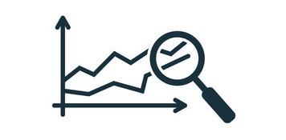

# Navigating Success: Harnessing Academic Data for Student Outcome Projections

<!-- Improved compatibility of back to top link: See: https://github.com/othneildrew/Best-README-Template/pull/73 -->
<a name="readme-top"></a>

<!-- PROJECT SHIELDS -->
<!--
*** I'm using markdown "reference style" links for readability.
*** Reference links are enclosed in brackets [ ] instead of parentheses ( ).
*** See the bottom of this document for the declaration of the reference variables
*** for contributors-url, forks-url, etc. This is an optional, concise syntax you may use.
*** https://www.markdownguide.org/basic-syntax/#reference-style-links
-->
[![Contributors][contributors-shield]][contributors-url]
[![Forks][forks-shield]][forks-url]
[![Stargazers][stars-shield]][stars-url]
[![Issues][issues-shield]][issues-url]
[![MIT License][license-shield]][license-url]
[![LinkedIn][linkedin-shield]][linkedin-url]


<!-- PROJECT LOGO -->
<br />
<div align="center">
  <a href="https://github.com/ishamahadalkar/Nashville_Housing">
    
  </a>
  
<!-- Section Name tag -->
<a name="#about-the-project"></a>
<h3 align="center">Academic Prediction</h3>

  <p align="center">
    This project aims to explore the effectiveness of machine learning in predicting student academic performance and the importance of early intervention in education. By analyzing various features, including demographic, socio-economic, and academic data, we seek to create predictive models that can identify at-risk students before they face academic challenges.
    <br />
  </p>
</div>


<!-- TABLE OF CONTENTS -->
<details>
  <summary>Table of Contents</summary>
  <ol>
    <li>
      <a href="#about-the-project">About The Project</a>
      <ul>
        <li><a href="#built-with">Built With</a></li>
      </ul>
    </li>
    <li>
      <a href="#getting-started">Getting Started</a>
      <ul>
        <li><a href="#prerequisites">Prerequisites</a></li>
        <li><a href="#installation">Installation</a></li>
      </ul>
    </li>
    <li><a href="#data-sources">Data Sources</a>
      <ul>
          <li><a href="#preprocessing">Preprocessing</a></li>
      </ul>
    </li>
    <li><a href="#approach">Approach</a></li>
    <li><a href="#code-structure">Code Structure</a></li>
    <li><a href="#lessons-learned">Lessons Learned</a></li>
    <li><a href="#future-work">Future Work</a></li>
    <li><a href="#license">License</a></li>
    <li><a href="#contact">Contact</a></li>
    <li><a href="#acknowledgments">Acknowledgments</a></li>
  </ol>
</details>

<!-- Section Name tag -->
<a name="#built-with"></a>

### Built With

* [![MySQL][MySQL.com]][MySQL-url]
* [![MySQLWorkbench][MySQLWorkbench.com]][MySQLWorkbench-url]

<p align="right">(<a href="#readme-top">back to top</a>)</p>


<!-- GETTING STARTED -->
## Getting Started

To get started with the project, follow these steps:

<!-- Section Name tag -->
<a name="#getting-started"></a>

### Prerequisites

<!-- Section Name tag -->
<a name="#prerequisites"></a>

- Python (version 3.6 or higher)
- Jupyter Notebook (optional)

### Installation

<!-- Section Name tag -->
<a name="#installation"></a>

1. Clone the repo
   ```sh
   git clone https://github.com/ishamahadalkar/Academic_Prediction
   ```
   
<p align="right">(<a href="#readme-top">back to top</a>)</p>

<!-- DATA SOURCES -->
## Data Sources

<!-- Section Name tag -->
<a name="#data-sources"></a>

The project utilizes a dataset from the Polytechnic Institute of Portalegre, Portugal, containing information on students enrolled in various degree programs. The dataset includes demographic, socio-economic, and academic data.

### Preprocessing

<!-- Section Name tag -->
<a name="#preprocessing"></a>

- Cleaning:

  1. Removed any duplicate rows or null values from the dataset.
  2. Renamed columns for improved readability and consistency.

- Encoding:

  1. Utilized One-Hot Encoding to convert categorical variables into numerical format.
  2. Encoded the target variable to assign specific integers to each label for modeling purposes.

- Feature Selection:

  1. Conducted feature selection to identify the most relevant attributes for predicting student outcomes.
  2. Analyzed feature correlations and relationships to the target variable.
  3. Manually selected features based on relevance to the problem and domain knowledge.
  4. Dropped less important features to reduce dimensionality of the dataset.

- Addressing Class Imbalance:

  1. Implemented SMOTE sampling technique to address class imbalance in the dataset.
  2. Generated synthetic samples for the minority class to achieve a balanced distribution.

<p align="right">(<a href="#readme-top">back to top</a>)</p>


<!-- APPROACH -->
## Approach

<!-- Section Name tag -->
<a name="#approach"></a>

1. Utilized various classification models, including:
  - Logistic Regression
  - Decision Trees
  - Random Forests
  - Support Vector Machines (SVMs)
  - Ensemble methods (e.g., Voting Classifier)

2. Models were trained to predict student outcomes based on:
  - First-year academic performance
  - Demographic and socio-economic factors


<p align="right">(<a href="#readme-top">back to top</a>)</p>

<!-- CODE STRUCTURE -->
## Code Structure

<!-- Section Name tag -->
<a name="#code-structure"></a>

The codebase is organized into:

Jupyter Notebooks: Used for exploratory data analysis, visualization, and iterative development of models. Contains modularized code for specific tasks such as data preprocessing, model development, and evaluation.

The file focuses on a distinct aspect of the project:

Data preprocessing: Cleaning, encoding, and feature selection.
Model development: Implementation of various classification algorithms.
Model evaluation: Assessing model performance using appropriate metrics.


<p align="right">(<a href="#readme-top">back to top</a>)</p>


<!-- Lessons Learned -->
## Lessons Learned

<!-- Section Name tag -->
<a name="#lessons-learned"></a>

1. Feature Selection: Importance of selecting relevant features to improve model performance and interpretability.
2. Model Evaluation: Understanding the significance of evaluation metrics in assessing model effectiveness.
3. Class Imbalance: Addressing class imbalance is critical for achieving reliable predictions, especially in educational datasets.
4. Complexity of Educational Data: Recognizing the complexities inherent in educational data and the challenges they pose for predictive analysis.

<p align="right">(<a href="#readme-top">back to top</a>)</p>

<!-- FUTURE WORK -->
## Future Work

<!-- Section Name tag -->
<a name="#future-work"></a>

Future work includes exploring deep learning architectures for improved predictive performance, enhancing model interpretability, and extending the study to other educational contexts.

<p align="right">(<a href="#readme-top">back to top</a>)</p>


<!-- LICENSE -->
## License

<!-- Section Name tag -->
<a name="#license"></a>

Distributed under the MIT License. See `LICENSE.txt` for more information.

<p align="right">(<a href="#readme-top">back to top</a>)</p>


<!-- CONTACT -->
## Contact

<!-- Section Name tag -->
<a name="#contact"></a>

Your Name - [@LinkedIn]([linked-url]) - mahadalkar.isha@gmail.com

Project Link: [https://github.com/ishamahadalkar/Academic_Prediction](https://github.com/ishamahadalkar/Academic_Prediction)

<p align="right">(<a href="#readme-top">back to top</a>)</p>


<!-- ACKNOWLEDGMENTS -->
## Acknowledgments

<!-- Section Name tag -->
<a name="#acknowledgments"></a>

* [Kaggle Nashville Housing Dataset](https://www.kaggle.com/datasets/tmthyjames/nashville-housing-data)

<p align="right">(<a href="#readme-top">back to top</a>)</p>


<!-- MARKDOWN LINKS & IMAGES -->
<!-- https://www.markdownguide.org/basic-syntax/#reference-style-links -->
[contributors-shield]: https://img.shields.io/github/contributors/ishamahadalkar/Academic_Prediction.svg?style=for-the-badge
[contributors-url]: https://github.com/ishamahadalkar/Academic_Prediction/graphs/contributors
[forks-shield]: https://img.shields.io/github/forks/ishamahadalkar/Academic_Prediction.svg?style=for-the-badge
[forks-url]: https://github.com/ishamahadalkar/Academic_Prediction/network/members
[stars-shield]: https://img.shields.io/github/stars/ishamahadalkar/Academic_Prediction.svg?style=for-the-badge
[stars-url]: https://github.com/ishamahadalkar/Academic_Prediction/stargazers
[issues-shield]: https://img.shields.io/github/issues/ishamahadalkar/Academic_Prediction.svg?style=for-the-badge
[issues-url]: https://github.com/ishamahadalkar/Academic_Prediction/issues
[license-shield]: https://img.shields.io/github/license/ishamahadalkar/Academic_Prediction.svg?style=for-the-badge
[license-url]: https://github.com/ishamahadalkar/Academic_Prediction/blob/master/LICENSE.txt
[linkedin-shield]: https://img.shields.io/badge/-LinkedIn-black.svg?style=for-the-badge&logo=linkedin&colorB=555
[linkedin-url]: https://linkedin.com/in/isha-mahadalkar
[product-screenshot]: images/screenshot.png
[Next.js]: https://img.shields.io/badge/next.js-000000?style=for-the-badge&logo=nextdotjs&logoColor=white
[Next-url]: https://nextjs.org/
[React.js]: https://img.shields.io/badge/React-20232A?style=for-the-badge&logo=react&logoColor=61DAFB
[React-url]: https://reactjs.org/
[Vue.js]: https://img.shields.io/badge/Vue.js-35495E?style=for-the-badge&logo=vuedotjs&logoColor=4FC08D
[Vue-url]: https://vuejs.org/
[Angular.io]: https://img.shields.io/badge/Angular-DD0031?style=for-the-badge&logo=angular&logoColor=white
[Angular-url]: https://angular.io/
[Svelte.dev]: https://img.shields.io/badge/Svelte-4A4A55?style=for-the-badge&logo=svelte&logoColor=FF3E00
[Svelte-url]: https://svelte.dev/
[Laravel.com]: https://img.shields.io/badge/Laravel-FF2D20?style=for-the-badge&logo=laravel&logoColor=white
[Laravel-url]: https://laravel.com
[Bootstrap.com]: https://img.shields.io/badge/Bootstrap-563D7C?style=for-the-badge&logo=bootstrap&logoColor=white
[Bootstrap-url]: https://getbootstrap.com
[JQuery.com]: https://img.shields.io/badge/jQuery-0769AD?style=for-the-badge&logo=jquery&logoColor=white
[JQuery-url]: https://jquery.com 
[MySQL.com]: https://img.shields.io/badge/MySQL-4479A1?style=for-the-badge&logo=mysql&logoColor=white
[MySQL-url]: https://www.mysql.com
[MySQLWorkbench.com]: https://img.shields.io/badge/MySQL_Workbench-4479A1?style=for-the-badge&logo=mysql&logoColor=white
[MySQLWorkbench-url]: https://www.mysql.com/products/workbench/
